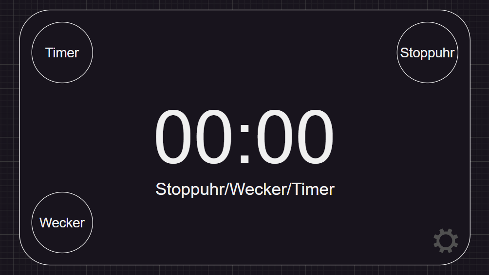

# Python Alarm Clock
Fynn Huber              
26.02.2025

&nbsp;

&nbsp;

## Idee
Mithilfe von Python in der IDE Visual Studio Code einen Wecker Programmieren. Der Wecker soll auch eine Benutzeroberfläche haben, wo Informationen angezeigt werden. Funktionen die der Wecker haben soll sind: 
- Uhrzeit anzeigen
- Wecker funktioen (einstellen, auslösen)
- Stoppuhr
- Timer

## Ziel
Ich möchte dieses Projekt meine Python-Kenntnisse erweitern, da ich noch mit viel in der Sprache gearbeitet habe. Ausserdem will ich mehr praktische Erfahrung durch eigene Projekte sammeln.

 &nbsp;

### 26.02.2025
  - [ ] Was brauche ich damit ich ein Interface (den "Bildschirm") des Weckers darstellen kann
  - [ ] Wie soll dieses Grob aussehen

**Fortschritt**            
Um in Python in GUI zu erstellen habe ich mich für das Tkinter Framework entschieden. Es ist einfach zu benutzen und gut um GUI für applikation zu erstellen. Ich werde mich damit befassen wie das Framework funktioniert wenn ich mit dem Projekt (Coden) anfange.

 &nbsp;
